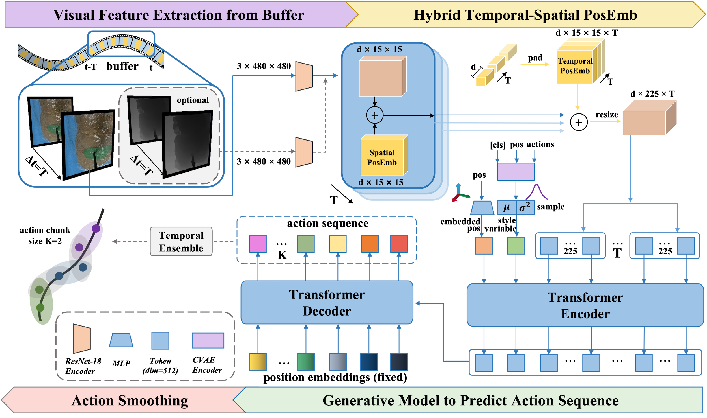
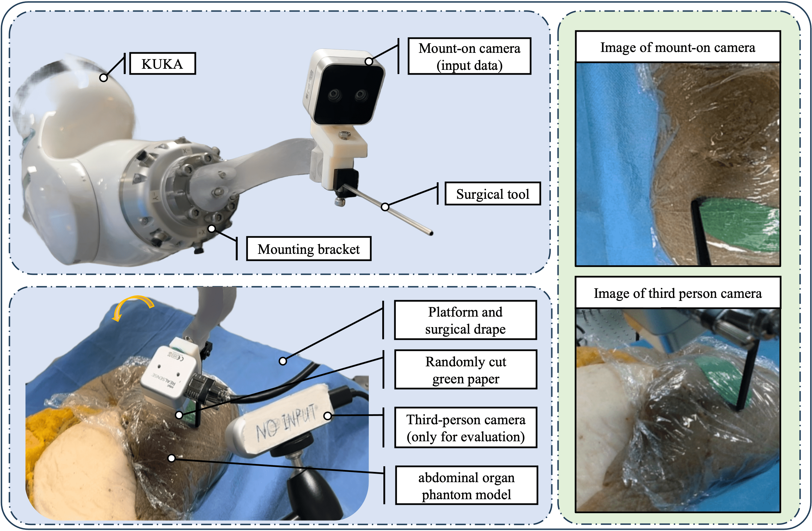
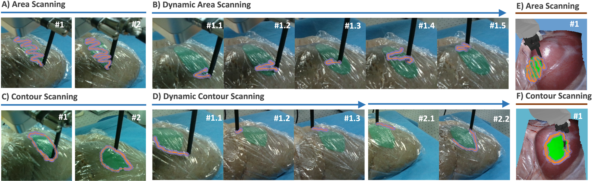

# Memorized Action Chunking with Transformers (MACT)

论文：[arXiv](https://arxiv.org/abs/2411.04050) · [HTML](https://arxiv.org/html/2411.04050v1)

面向组织表面扫描中长程任务依赖与精细接触控制并存的问题，针对 ACT 仅依赖当前观测、难以感知整体扫描进程的局限，MACT 将其扩展为历史视觉条件驱动的模仿学习策略，通过历史图像序列记忆、混合时空位置编码等，联合建模扫描进程与组织空间结构，生成连续、细粒度的机器人运动；项目完成了从 Bullet 仿真与任务生成、示教数据采集到 KUKA 实机部署验证的完整流程。

## 架构

## 实验

[▶ 查看演示视频](video.mp4)

> 本项目于2024年2月完成
